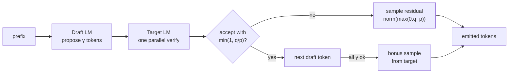

# ai-learn-25-speculative-decoding

Speculative decoding (draft-then-verify) from scratch in NumPy: a cheap **draft** n-gram LM proposes γ tokens, a stronger **target** LM verifies them in one parallel forward, and we accept a prefix with the Leviathan/Chen `min(1, q/p)` rule (residual resample on rejection). We sweep γ and draft quality, and compare FLOP cost vs vanilla target-only decoding.

Part of the AI learning series (after `ai-learn-24-mixture-of-experts`).

## Architecture



## What you'll learn
- How speculative / assisted generation works: draft proposes, target verifies in parallel, accept until the first rejection.
- The Leviathan/Chen accept/reject rule `min(1, q(x)/p(x))` and why sampling from the residual `norm(max(0, q−p))` keeps the **exact** target distribution.
- Why a perfect draft (p ≡ q) accepts everything and still speeds up (one target forward yields γ+1 tokens).
- The γ tradeoff: longer drafts amortise the verify better when acceptance is high, but waste draft work when it is low.
- How draft quality (TV distance to the target) drives acceptance rate and FLOP speedup.

## Layout
| file | purpose |
|---|---|
| `corpus.py` | Tiny synthetic character phrases + encode/decode helpers |
| `lm.py` | Count-based n-gram LMs (bigram draft, trigram target), vanilla decode, FLOP proxies |
| `speculate.py` | Speculative step/decode + draft↔target distribution comparison |
| `run_smoke.py` | γ sweep + draft-quality sweep → `results/` |
| `smoke_plots.py` | SVG plots + RESULTS.md writer |
| `svg_utils.py` | Makes SVGs smaller so they are easy to diff |
| `notebooks/speculative_decoding.ipynb` | Step-by-step walkthrough |
| `results/` | `RESULTS.md`, `metrics.json`, `JSON.shot`, SVG plots from the real smoke run |

## Run
```bash
pip install -r requirements.txt
python run_smoke.py          # ~1 s on CPU, seed 42, writes results/
jupyter notebook notebooks/speculative_decoding.ipynb
```

## Results (seed 42, from `results/metrics.json`)
| setting | accept rate | FLOP speedup | notes |
|---|---|---|---|
| γ=4, pure draft | **0.3738** | **1.55×** | best γ in the sweep |
| γ=1 … 8 sweep | 0.57 → 0.26 | 1.34–1.55× | peak at γ=4 |
| perfect draft (mix=0, γ=4) | **1.0** | **3.05×** | law check: TV=0 |
| draft / target held-out ppl | 2.91 / 1.70 | — | trigram is stronger |
| wall time | — | — | **0.29 s** CPU |

See [results/RESULTS.md](results/RESULTS.md) for the full tables and plots.

## Caveats
- FLOP speedup is a **cost model** (draft cheap, one parallel target verify per step), not measured GPU wall time.
- Toy character n-grams, not a real LLM — the algorithm is the same, the scale is tiny.
- Sequence exact-match vs an independent target-only run is low even when the sampling law is exact; paths differ.

## Next steps
- Swap n-grams for the mini-transformer from ai-learn-04 (draft = fewer layers).
- Tree attention / Medusa-style multi-head drafts.
- Measure real wall time with a batched NumPy "parallel" verify vs sequential.
