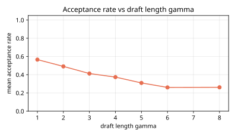
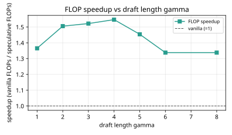
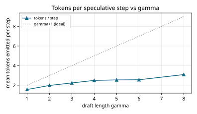
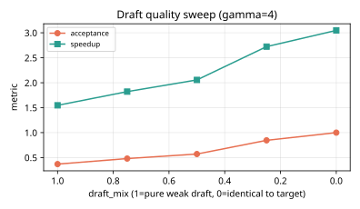

# Results: ai-learn-25-speculative-decoding

Real output of `python run_smoke.py` (seed 42, CPU, 0.29 s wall time).

## Setup
- Corpus: synthetic character phrases (27839 chars, vocab 21), repeats=40.
- **Draft** LM: order-2 n-gram, cost_per_token=1.0 (cheap).
- **Target** LM: order-3 n-gram, cost_per_token=8.0 (expensive).
- Speculative decoding: Leviathan/Chen accept/reject with `min(1, q/p)`, residual resample on rejection,
  bonus target sample when all gamma draft tokens are accepted. Parallel verify charged as **one** target forward.
- Generation: 24 prompts x 32 new tokens; gamma sweep [1, 2, 3, 4, 5, 6, 8];
  draft_mix sweep [1.0, 0.75, 0.5, 0.25, 0.0] at gamma=4.
- Exact-match: fraction of speculative sequences that equal a target-only decode under a coupled RNG
  protocol. Reported against independent target-only baselines with matched seeds.

## gamma sweep (pure draft, draft_mix=1)
| gamma | accept rate | accepted/step | emitted/step | FLOP speedup | exact-match vs target-only | speculative FLOPs |
|---|---|---|---|---|---|---|
| 1 | 0.5656 | 0.5656 | 1.5656 | 1.3653 | 0.0 | 4500.0 |
| 2 | 0.491 | 0.9819 | 1.9819 | 1.5059 | 0.0 | 4080.0 |
| 3 | 0.4122 | 1.2365 | 2.2365 | 1.5219 | 0.0 | 4037.0 |
| 4 | 0.3738 | 1.4952 | 2.4952 | 1.5468 | 0.0 | 3972.0 |
| 5 | 0.3094 | 1.547 | 2.547 | 1.4542 | 0.0 | 4225.0 |
| 6 | 0.2601 | 1.5607 | 2.5607 | 1.338 | 0.0 | 4592.0 |
| 8 | 0.2614 | 2.0911 | 3.0911 | 1.338 | 0.0 | 4592.0 |

## Draft-quality sweep (gamma=4)
| draft_mix | mean TV(draft,target) | accept rate | FLOP speedup | exact-match |
|---|---|---|---|---|
| 1.0 | 0.3128 | 0.3691 | 1.5468 | 0.0 |
| 0.75 | 0.2346 | 0.4796 | 1.8221 | 0.0 |
| 0.5 | 0.1564 | 0.5716 | 2.0562 | 0.0 |
| 0.25 | 0.0782 | 0.8453 | 2.7234 | 0.0 |
| 0.0 | 0.0 | 1.0 | 3.0476 | 0.0 |

## Headline
- Best gamma by speedup: **gamma=4** -> speedup **1.5468x**, acceptance **0.3738**,
  emitted/step **2.4952**.
- Draft / target perplexity on held-out slice: draft **2.9056**, target **1.7026**.
- Vanilla target FLOPs for 32 tokens x 24 prompts: **6144.0**.

## Plots
- 
- 
- 
- 

## Notes
- FLOP speedup is a **cost-model** proxy (draft cheap, one parallel target verify per step), not wall-clock on a GPU.
- Exact distributional equivalence holds for the accept/reject math; sequence exact-match vs an independent
  target-only run is intentionally < 1 because sampling paths differ even when laws match.
